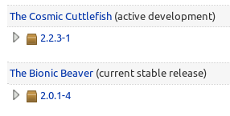

# Step 3: pybind11

Ubuntu 18.04 comes with an [older version of pybind11](https://launchpad.net/ubuntu/+source/pybind11), causing compile errors with caffe2.



Install packages required for build:

    apt-get install checkinstall cmake g++ python3 python3-dev python3-pytest git

```checkinstall``` isn't strictly required, but it generates a ```.deb``` making installation and removal easier.

    git clone --branch v2.2.3 --depth 1 --recursive --recurse-submodules -j8 https://github.com/pybind/pybind11.git
    cd pybind11/
    mkdir build
    cd build
    cmake -DCMAKE_BUILD_TYPE=RELEASE \
		-DCMAKE_CXX_COMPILER=`which g++-6` \
		-DPYTHON_EXECUTABLE=`which python3` \
		-DCMAKE_CXX_FLAGS="-I/usr/local/cuda-9.2/include -I/usr/local/cuda-9.2/include/crt" \
		..
    checkinstall --install=no --default --pkgname=pybind11 --pkgversion=2.2.3 --pkgrelease=1 --pkglicense=BSD make -j8 install

    dpkg -i pybind11_2.2.3-1_amd64.deb

# Issues

If it *doesn't* work, open an issue: https://github.com/jed-frey/build_caffe2/issues/new

Attach ```/var/log/nvidia-installer.log```.
