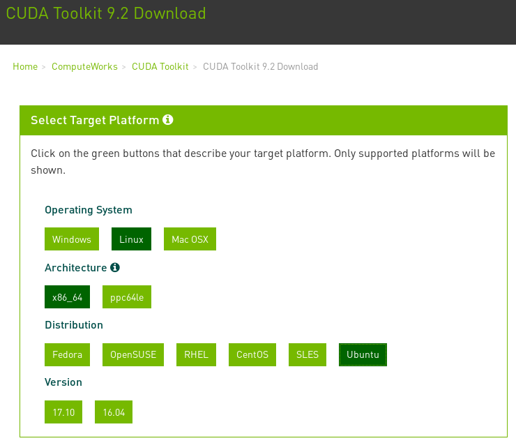

**tl;dr**: [Step 1: Install NVIDIA Drivers](01_NVIDIA.md).

# Update

    http://developer.download.nvidia.com/compute/cuda/repos/ubuntu1804/x86_64/


# Build Caffe2 with CUDA 9.2 on Ubuntu 18.04

**What**: [Caffe2: *A New Lightweight, Modular, and Scalable Deep Learning Framework*](https://caffe2.ai/)

**Where**: Ubuntu 18.04 LTS. [LTS is an abbreviation for “Long Term Support”.](https://wiki.ubuntu.com/LTS) A new LTS version is released every two years. In previous releases, a Long Term Support (LTS) version had three years support on Ubuntu (Desktop) and five years on Ubuntu Server.

**Why**: In software development it's not an issue of if your development environment becomes 'legacy' but when. Kicking the can down the road just makes it a bigger problem later. (See also Python 2).

Ubuntu LTS releases have become popular for academic and industry projects. Way too many projects still only have 14.04, or even 12.04 instructions & support.

| Release | End of Life |
|---------|-------------|
| 14.04   | April 2019  |
| 16.04   | April 2021  |
| 18.04   | April 2023  |
| 20.04   | April 2025  |


- Ubuntu 18.04 was just released and all Ubuntu machines in my house have been upgraded.
- Caffe2 because:
    - [Model Zoo](https://caffe2.ai/docs/zoo.html) for pre-trained models.
    - [Backed by Facebook](https://medium.com/@Synced/caffe2-merges-with-pytorch-a89c70ad9eb7).
    - [Overchoice](https://en.wikipedia.org/wiki/Overchoice) of frameworks, just picking one for now.

# Hurdles

[At the time of this writing, Aug 2018]

- Nvidia's CUDA Toolkit 9.2 only officially supports Ubuntu 17.10 & 16.04
- [Ubuntu 18.04's ```pybind11``` is version 2.0.1, latest is 2.2.3.](https://launchpad.net/ubuntu/+source/pybind11)



# Corrections & Issues

The only real way to test this is a fresh install, so after a while it gets tedius. If you find something doesn't work, open an issue:

https://github.com/jed-frey/build_caffe2/issues/new

If you know how to correct the issue, create a pull request with the fixes.
